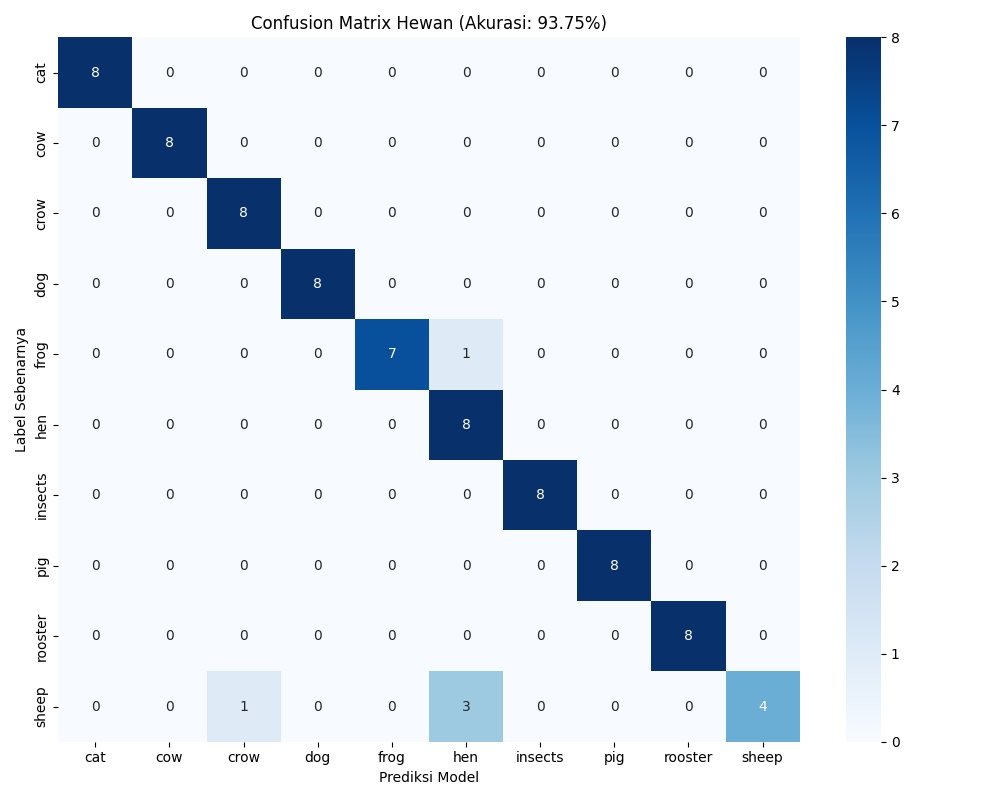

# Klasifikasi Suara Hewan dengan Semi-Supervised Contrastive Learning 🎵


Repositori ini berisi implementasi metode **Semi-Supervised Contrastive Learning** untuk klasifikasi suara lingkungan menggunakan dataset **ESC-50**.

Proyek ini dibangun sebagai bagian dari validasi penelitian Skripsi untuk membuktikan bahwa metode yang diajukan (SimCLR-based Audio Classification) bersifat *robust* (tangguh) dan dapat digeneralisasi pada domain data yang berbeda (dalam kasus ini: Suara Hewan).

## 📊 Hasil Eksperimen

Model diuji pada subset **Suara Hewan (Animals)** dari dataset ESC-50 yang terdiri dari 10 kelas (Anjing, Kucing, Ayam, Sapi, dll).

- **Akurasi Total:** **93.75%**
- **Metode:** Pre-training pada data *unlabeled* + Fine-tuning pada data *labeled*.


*(Gambar: Confusion Matrix yang menunjukkan performa prediksi model pada 10 kelas hewan)*

## 🚀 Fitur Utama

Sistem ini menggunakan pendekatan dua tahap (Two-Stage Training):

1.  **Stage 1: Unsupervised Pre-training**
    Model belajar mengenali fitur dan karakteristik suara secara mandiri dari data tanpa label (*unlabeled*) menggunakan *Contrastive Loss* (NT-Xent). Model dipaksa untuk memahami bahwa suara asli dan suara yang dimodifikasi (augmentasi) adalah entitas yang sama.

2.  **Stage 2: Supervised Fine-tuning**
    Pengetahuan (bobot encoder) dari Stage 1 ditransfer untuk melatih *Classifier* menggunakan data berlabel yang jumlahnya terbatas.

## 🛠️ Instalasi

Pastikan Anda sudah menginstall Python. Jalankan perintah berikut di terminal:

1.  **Clone Repositori ini:**
    ```bash
    git clone https://github.com/Mystery-World3/SoundCLR-PyTorch.git
    cd Semi-Supervised-Contrastive-Learning-Audio
    ```

2.  **Install Library yang Dibutuhkan:**
    ```bash
    pip install -r requirements.txt
    ```

3.  **Siapkan Dataset:**
    - Download dataset [ESC-50 di sini](https://github.com/karolpiczak/ESC-50).
    - Ekstrak folder `ESC-50-master` ke dalam folder proyek ini.

## 💻 Cara Penggunaan

Ikuti langkah-langkah berikut untuk melatih model dari awal:

### 1. Persiapan Data (Preprocessing)
Script ini akan memfilter dataset ESC-50 (mengambil hanya kategori hewan) dan membaginya menjadi folder `labeled` dan `unlabeled`.
```bash
python prepare_animals.py
```
### 2. Training Tahap 1 (Pre-training)
Melatih model untuk belajar fitur suara dari data unlabeled. Output: animal_pretrained.pth.
```bash
python train_pretrain.py
```
### 3. TTraining Tahap 2 (Fine-tuning)
Melatih classifier untuk mengenali nama hewan (Dog, Cat, dll). Output: animal_final.pth.
```bash
python train_classifier.py
```
### 4. Evaluasi & Visualisasi
Menghitung akurasi total dan membuat gambar Confusion Matrix (matrix_hewan.png).
```bash
python evaluate_animals.py
python plot_matrix.py
```
### 2. Uji Coba Manual
Ingin mengetes model dengan file suara Anda sendiri? Jalankan script ini dan drag-and-drop file .wav ke terminal.
```bash
python predict_train.py
```
## 👤 Author
**Muhammad Mishbahul Muflihin** *Software Engineering Student at Darussalam Gontor University*

 Email: [mishbahulmuflihin@gmail.com](mailto:mishbahulmuflihin@gmail.com)
